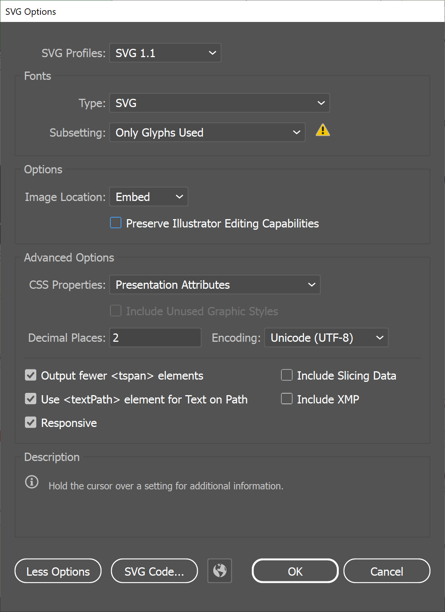

# SVG Translation Workflow: Revelation Graphics

This directory contains a notebook-based SVG translation workflow for two Revelation graphics from [basicsofthebible.org](https://basicsofthebible.org/):

- *Seven Churches of Revelation*
- *Structure of Revelation*

The workflow extracts translatable SVG text, prepares translation units, sends those units to an LLM, writes translated SVG outputs, and then optionally performs deterministic cleanup of Bible reference abbreviations in the translated SVGs.

This Revelation example follows the earlier BST (*Bible Structure and Timeline*) and TBE (*Timeline of Bible Events*) SVG workflow pattern, but adds Revelation-specific filtering and cleanup rules, including Greek-text preservation, Bible-reference detection, repeated-term notes, symbol-only text preservation, ordinal-suffix handling, and final Spanish Bible-reference abbreviation normalization.

## Contents

### Notebooks

- `00_open_and_inspect_svg.ipynb`  
  Opens SVG files, extracts text and tspan elements, applies Revelation-specific filtering and review rules, and writes prepared translation-unit JSON files.

- `01_translate_svg.ipynb`  
  Loads translation units, sends packetized JSON requests to the configured LLM, validates and saves translated JSON output, applies translations back into SVG files, exports review tables, and writes collapsed-tspan SVG outputs when needed.

- `02_finalize_bible_reference_abbreviations.ipynb`  
  Performs deterministic final cleanup on already translated and collapsed SVG files, normalizing selected Bible-reference abbreviations for the target language without making additional LLM calls.

### Supporting Files

- `bible_reference_helpers.py`  
  Bible book abbreviation metadata and helper functions used by the Revelation-specific reference detection and cleanup steps.

- `Illustrator_svg_settings.jpg`  
  Reference image for the Adobe Illustrator SVG export settings used by this workflow.

### Subdirectories

- `svg_source_files/`  
  Source SVG files to be processed.

- `json_files/`  
  Extracted text records, prepared translation units, translated JSON output, and Bible-reference normalization review JSON.

- `svg_output_files/`  
  Translated SVG files, collapsed-tspan SVG files, final-reference-cleanup SVG files, and CSV / XLSX / Markdown review tables.

## Workflow

### Step 1 - Extract and Prepare SVG Text

Run:

- `00_open_and_inspect_svg.ipynb`

This notebook:

- loads SVG files from `svg_source_files/`
- parses text and tspan elements
- preserves meaningful whitespace from fragmented tspans
- identifies text that should be translated, preserved, or reviewed
- applies Revelation-specific filters and notes
- writes translation-unit JSON to `json_files/`

Main outputs include:

- `json_files/translation_units.json`
- `json_files/translation_units_full_prepared.json`

### Step 2 - Translate and Reinsert Text

Run:

- `01_translate_svg.ipynb`

This notebook:

- loads `json_files/translation_units.json`
- batches translation units into request-sized packets
- sends packets to the configured LLM
- validates returned JSON
- saves timestamped translated JSON files
- applies translated text back into the source SVGs
- writes translated and collapsed-tspan SVG files to `svg_output_files/`
- exports CSV, XLSX, and Markdown review tables

A local `.env` file is used for API credentials when running the translation notebook. The current notebook expects `GEMINI_API_KEY`. Do not commit `.env` to the repository.

### Step 3 - Finalize Bible Reference Abbreviations

Run:

- `02_finalize_bible_reference_abbreviations.ipynb`

This notebook:

- loads the prepared unit state and translated SVG output
- identifies Bible-reference-related SVG elements
- applies deterministic target-language abbreviation replacements
- writes final SVG files with `_final_refs_` in the filename
- writes Bible-reference normalization review JSON

## Current Outputs

The current non-obsolete final SVG outputs are:

- `svg_output_files/SevenChurchesOfRevelation_spanish_20260520_1459_collapsed_tspans_final_refs_20260520_1646.svg`
- `svg_output_files/StructureOfRevelation_spanish_20260520_1459_collapsed_tspans_final_refs_20260520_1646.svg`
- `svg_output_files/StructureOfRevelation_spanish_20260520_2017_collapsed_tspans_final_refs_20260520_2024.svg`

The retained JSON and SVG output artifacts include completed Spanish translation outputs for both Revelation graphics. Some timestamped artifacts may reflect separate notebook runs for each graphic.

## Expected Working Structure

```text
rev/
├── 00_open_and_inspect_svg.ipynb
├── 01_translate_svg.ipynb
├── 02_finalize_bible_reference_abbreviations.ipynb
├── README.md
├── bible_reference_helpers.py
├── Illustrator_svg_settings.jpg
├── svg_source_files/
├── json_files/
└── svg_output_files/
```

## Python Dependencies

The notebooks are intended to be run from a local Python/Jupyter environment with access to a local `.env` file containing `GEMINI_API_KEY`. The local `.env` file is ignored by git and should not be published.

In addition to standard Python libraries, the notebooks use packages such as:

- `pandas`
- `lxml`
- `python-dotenv`
- `google-genai`
- `httpx`
- `openpyxl`
- `IPython`

This repository does not currently include a dedicated requirements file for this example. The workflow was run locally in an Anaconda/Jupyter environment.

## Licensing Note

The code in this workflow is part of the repository-wide MIT-licensed codebase unless otherwise noted.

The example SVG source files and related creative materials in this folder are original creative works by Shawn Handran and are licensed under the Creative Commons Attribution-NonCommercial-ShareAlike 4.0 International license (CC BY-NC-SA 4.0).

You may share and adapt those example materials for noncommercial purposes with attribution, and any adaptations must be distributed under the same license.

License details: https://creativecommons.org/licenses/by-nc-sa/4.0/

## Illustrator SVG Save Settings

These source SVGs should be exported from Adobe Illustrator with browser-compatible SVG structure rather than Illustrator-private editing data. The reference screenshot is included here:



When saving a copy as SVG in Illustrator, use settings consistent with the screenshot:

- SVG Profile: `SVG 1.1`
- Fonts Type: `SVG`
- Fonts Subsetting: `Only Glyphs Used`
- Images: `Embed`
- Decimal Places: `2`
- CSS Properties: `Presentation Attributes`
- Encoding: `Unicode (UTF-8)`
- Output fewer <tspan> elements: checked
- Responsive: checked

**Do not** enable `Preserve Illustrator Editing Capabilities`; that setting adds Illustrator-specific data and prevents the reconstructed svg file from being imported back into Illustrator.
